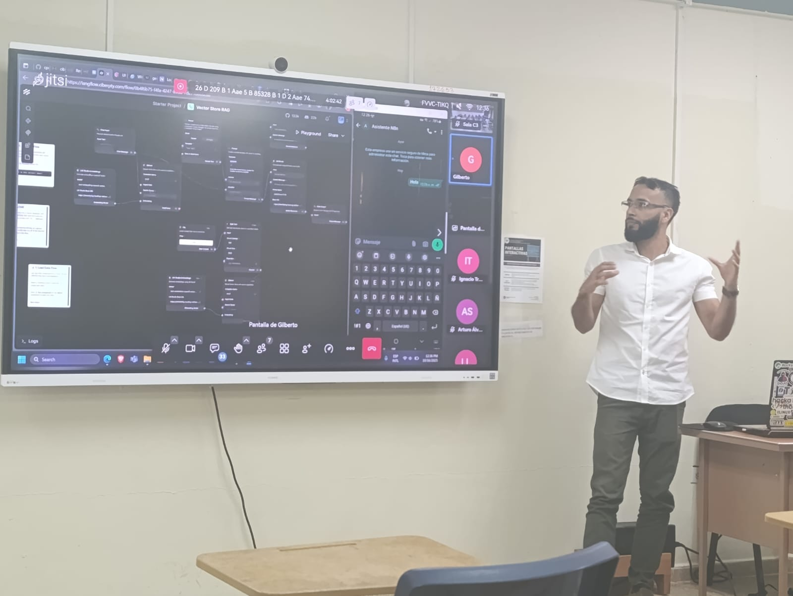

  

###

  
  

###

  

###

<h1 align="center">hey there 👋</h1>

###

<h3 align="left">👩‍💻  About Me</h3>

###

I'm Gilberto from Panamá.  
- 🔭 I’m a cybersecurity student. 
- 📚 I'm currently learning about DevOps/SysAdmin, connecting LLM models with n8n and different APIs to automate workflows. 
- ⚡ In my free time, I dedicate myself to learning new technologies and practicing every day to improve my skills. 
- 📫 How to reach me: gilbertr474@gmail.com

###

<h3 align="left">🛠 Language and tools</h3>

###

  
  
  
  
  
  
  
  
  
  
  
  
  

###

  

  

<h3 align="left">🔥   My Stats :</h3>

  

