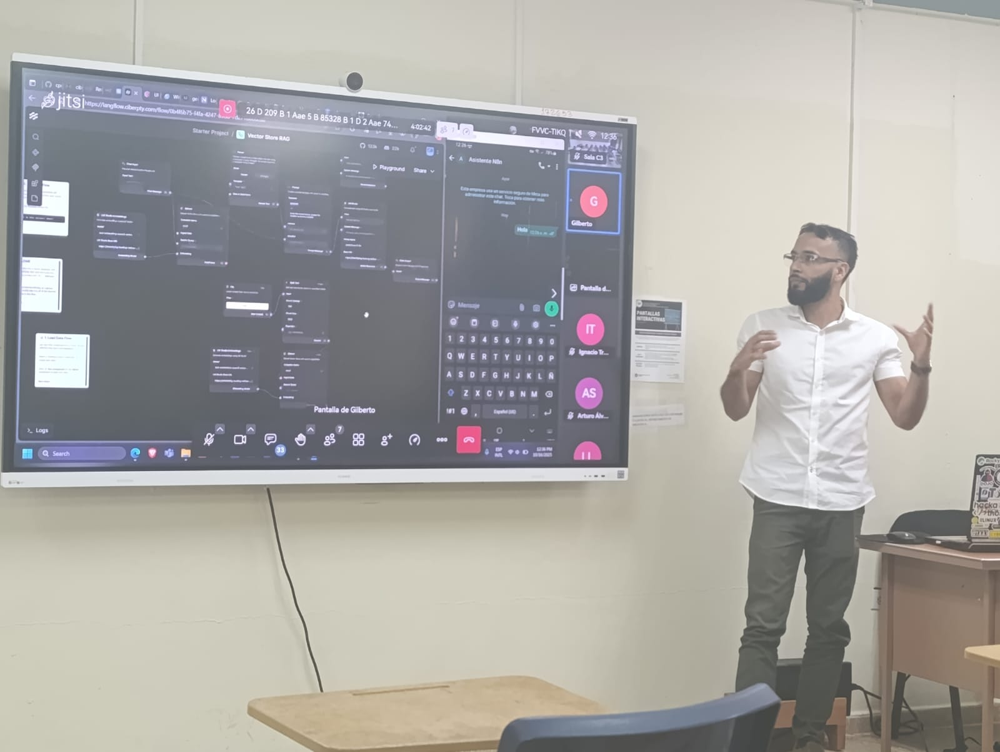

  

###

  
  

###

  

###

<h1 align="center">hey there 👋</h1>

###

<h3 align="left">👩‍💻  About Me</h3>

###

I'm Gilberto from Panamá.  
- 🔭 I’m a cybersecurity student currently finishing my degree at UTP. 
- 📚 I'm focused on SRE, SysAdmin, Linux infrastructure, automation, monitoring and cybersecurity labs. 
- ⚙️ I work with homelab environments using Proxmox, Docker, Ansible, MariaDB, n8n, Wazuh and Azure. 
- 🤖 I also experiment with AI workflows, RAG, local LLMs, MCP and agents connected to APIs. 
- 🌐 Personal site: <a href="https://www.ciberpty.com">www.ciberpty.com</a> 
- 📫 How to reach me: gilberto@ciberpty.com

###

<h3 align="left">🛠 Language and tools</h3>

###

  
  
  
  
  
  
  
  
  
  
  
  
  

###

<h3 align="left">🧩 Experience and interests</h3>

- Practiced technical support and basic server administration with <a href="https://servidoresrapidos.net/">Servidores Rapidos</a>, helping with Linux/Windows environments and incident review. 
- Built and maintain small web projects and services running from a personal homelab. 
- Interested in reliability, observability, automation, incident response and secure infrastructure operations. 
- Presented cybersecurity topics at UTP Veraguas, including a honeypot exploration for Clinicas Informaticas 2024. 
- Participated in Hackathon Copa Airlines, AMALIACONF 2025, WICI-2025 and Security BSides 2026.

###

<h3 align="left">🎓 Education and certifications</h3>

- B.Sc. track in Cybersecurity at UTP, currently in the final semester. 
- Technical engineering specialization in Cybersecurity. 
- Specialized MSS/SOC program. 
- Introduction to non-relational databases. 
- Introduction to Model Context Protocol (MCP).

###

  

<h3 align="left">🔥   My Stats :</h3>

  

